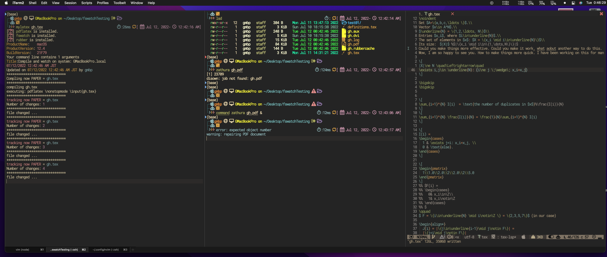
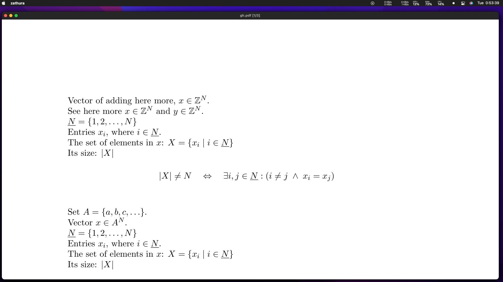

# MyLatex

A CLI for updating and auto-compiling `*.tex ` file in Latex Environment. Work
for both GNU LINUX and macOS.




## Requirements

### macOS

We will need the following requirements:

- [x] `pdflatex` comes with installing `Latex` engine.
- [x] `rubber` similar to the `pdflatex` see the note below on how to install it for macOS.
- [x] `fswatch` this command line will allow watching file changes in the given directory.

#### How to install Rubber for mac

`rubber` is no longer existed, and there is a way around to install it.
For your given `python3` which is the default for the system: do the following.

```sh
git clone https://gitlab.com/latex-rubber/rubber.git ~/.rubber
cd ~/.rubber
python3 setup.py install     # this will create the build direcotry with the binary (executable) inside namely: rubber
python3 setup.py clean --all # this will remove the build directory
```

You will see that `rubber` get to install to your default python which is in my
case `anaconda` (`~/opt/anaconda3/bin`). Check the installation by

```sh
cd ~/opt/anaconda3/bin
ls | grep rubber
```

- [Install rubber](https://gitlab.com/latex-rubber/rubber/)

#### Install `fswatch`

Check here:

- [Tutorial- Introduction to fswatch](http://emcrisostomo.github.io/fswatch/doc/1.5.0/html/fswatch/Tutorial-Introduction-to-fswatch.html)
- [How to use fswatch](https://stackoverflow.com/questions/1515730/is-there-a-command-like-watch-or-inotifywait-on-the-mac)

```sh
brew install fswatch
```

### GNU/Linux systems - Ubuntu 20.22

You will need only these packages:

```sh
sudo apt-get install rubber
sudo apt-get install inotify-tools
```

# Setup

A simple curl for my `raw-script` which can be used to check the script, or map it to your machine

```sh
# To watch
curl -L https://raw.githubusercontent.com/Ghasak/myLatex/main/mylatex | bat
# To install
mkdir ~/.mylatex # or whatever
cd ~/.mylatex
touch mylatex
curl -L https://raw.githubusercontent.com/Ghasak/myLatex/main/mylatex >> ~/.mylatex/mylatex
chmod -x ~/.mylatex/mylatex
# In your .profile, or .zshrc or .bashrc whatever is your running sh, put
source PATH="$PATH:$HOME/.mylatex/"

```

# How to use

keep the sh running to monitor your `.text` script-file.

```sh
mylatex text_file.tex
```

## Formatter

I also have added the formatter with nvim which is based on the following command line

- [latexindent utility](https://github.com/cmhughes/latexindent.pl?tab=readme-ov-file)


